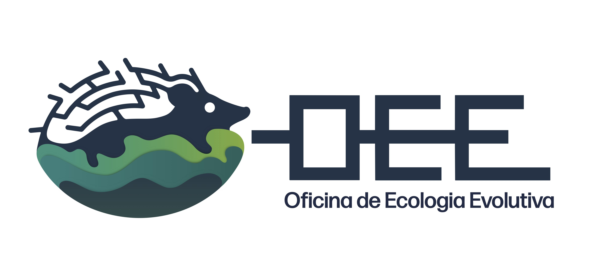

--- 
title: "Oficina de Ecologia Evolutiva"
author: "Renan Maestri & Leandro Duarte"
date: "`r Sys.Date()`"
site: bookdown::bookdown_site
documentclass: book
bibliography: [book.bib, packages.bib]
url: https://renanmaestri.github.io/oee/
cover-image: images/Logo JPEG.jpg
description: |
  Website da disciplina Oficina de Ecologia Evolutiva (OEE) - PPG Ecologia UFRGS.
biblio-style: apalike
csl: chicago-author-date.csl
output: bookdown::pdf_document2
---

# Prefácio {-}

```{r, echo=FALSE, out.width='70%', fig.align='center'}

```

Bem-vindo ao site da disciplina **Oficina de Ecologia Evolutiva (OEE)**, oferecida pelo Programa de Pós-Graduação em Ecologia da Universidade Federal do Rio Grande do Sul (UFRGS).

Este material contém o material didático e as atividades práticas desenvolvidas ao longo da disciplina.

## Sobre a Disciplina {-}

A disciplina tem como objetivo introduzir conceitos fundamentais e avanços teóricos e metodológicos recentes relacionados ao estudo da macroevolução, dos métodos filogenéticos comparativos, e dos padrões filogenéticos em comunidades ecológicas e regiões biogeográficas. Oferece treinamento sobre a manipulação de filogenias, dados fenotípicos, e dados espaciais/geográficos em ecologia através de análises práticas conduzidas no software R.

A disciplina é dividida em dois módulos principais de aulas teóricas e práticas, seguidos por um terceiro módulo voltado para o desenvolvimento de projetos individuais pelos discentes:

* **Módulo I - Macroevolução e Métodos Filogenéticos Comparativos**
* **Módulo II - Ecologia Filogenética de Comunidades e Macroecologia Evolutiva**
* **Módulo III - Desenvolvimento de Projetos**

## Dados e Arquivos {-}

Todos os scripts, dados e filogenias necessários para realizar as atividades práticas deste site estão disponíveis publicamente e podem ser obtidos no repositório GitHub da disciplina:

* [Repositório GitHub (renanmaestri/oee)](https://github.com/renanmaestri/oee)
* [Pasta de Dados (dados/)](https://github.com/renanmaestri/oee/tree/main/dados)

Você pode baixar a pasta de dados completa ou clonar/baixar o repositório inteiro para o seu computador.

